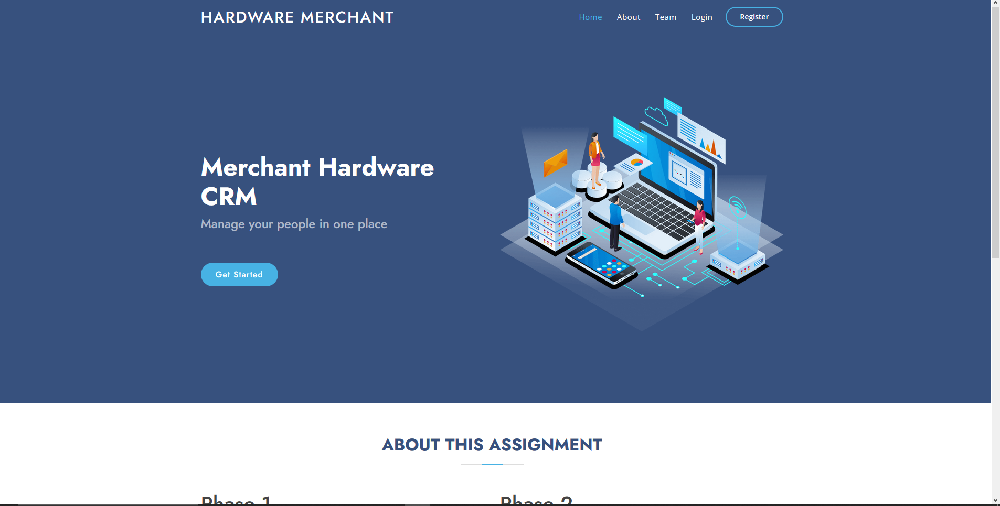

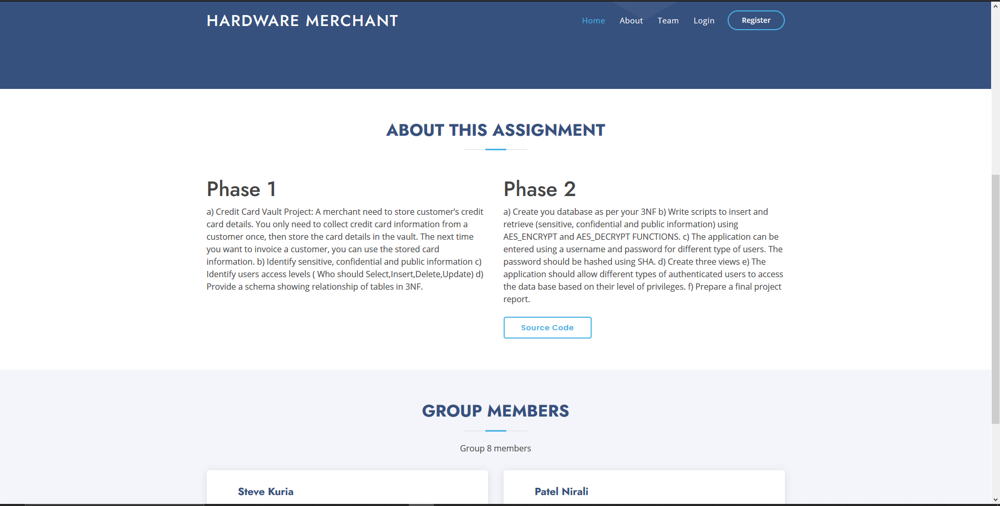
# Description of the System: 

This is a system that stores credit card information for customers by the merchant in a secure vault. This information is collected only once and next time a customer is invoiced, the merchant can use the stored card information. The information is encrypted and hashed using SHA and there are different user levels for example, super administration of the system, the administrator and user. All these are authenticated and can only access the data according to their level of privilege. 

# Registration page

A new user wishing to purchase a product from the website must first have an account. 

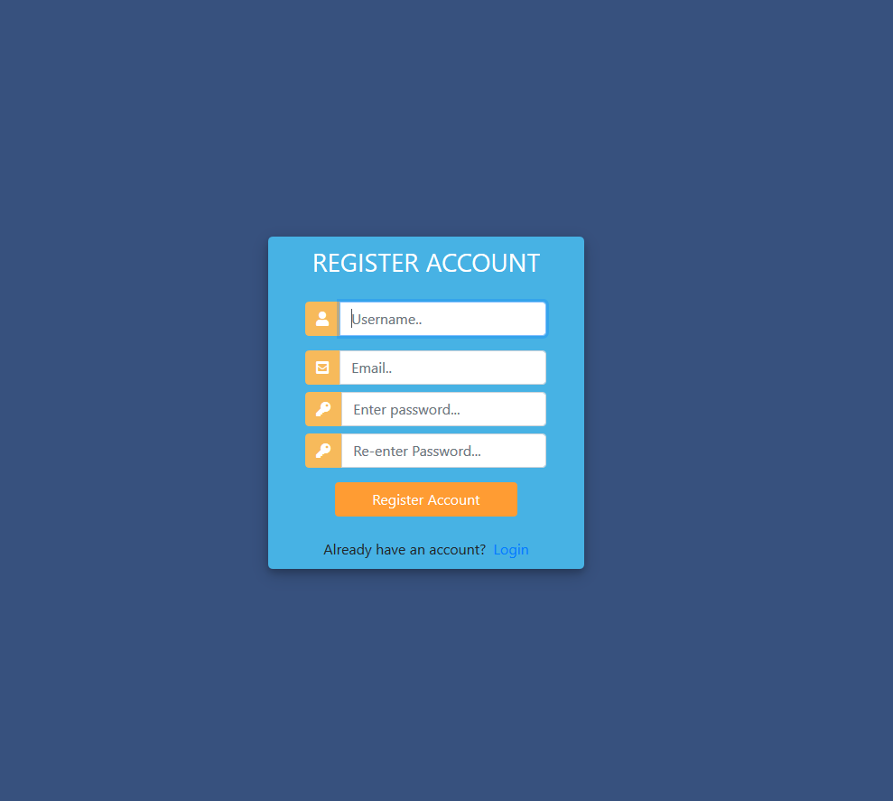

# Login Page
   
This is a view of the login page in case the user comes back to purchase something. 

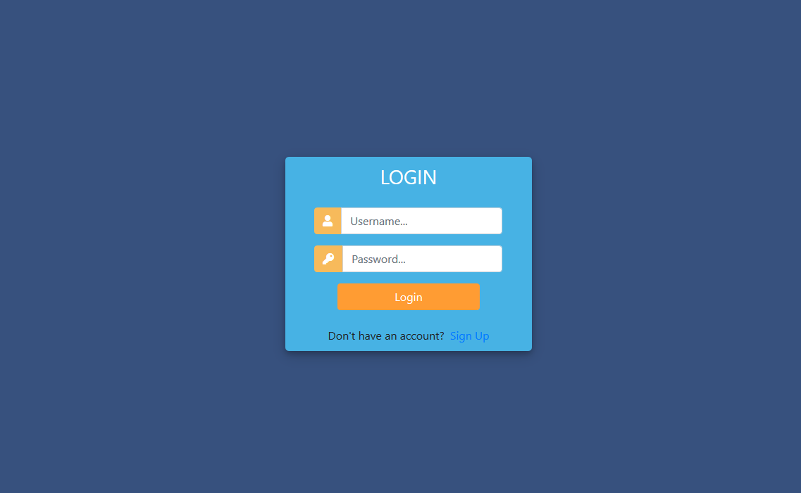

# User view

By default all new signups are assigned a class of Customer

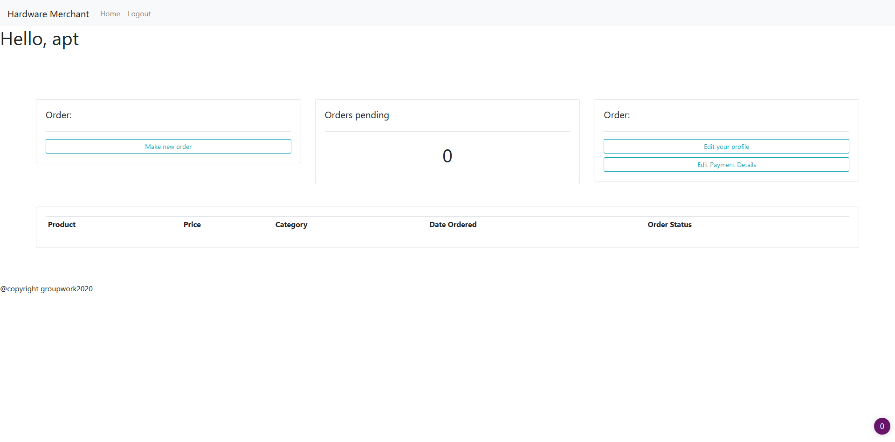

The customer can edit their credit card info. Only the customer can view their credit card info.
The cvv and credit card info is encrypted using AES in the db thus even of the db was hacked the
hackers would not know the credit card details. Furthermore even the super user views encrypted credit card details and cvv in the django admin.
The supervisor can send invoices but the credit card details are only visible in the email.

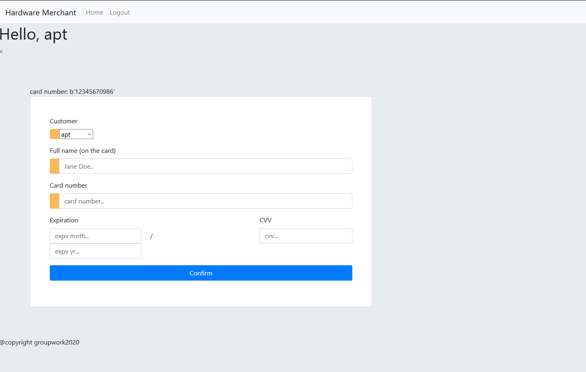
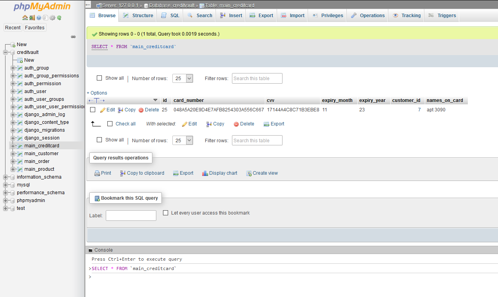
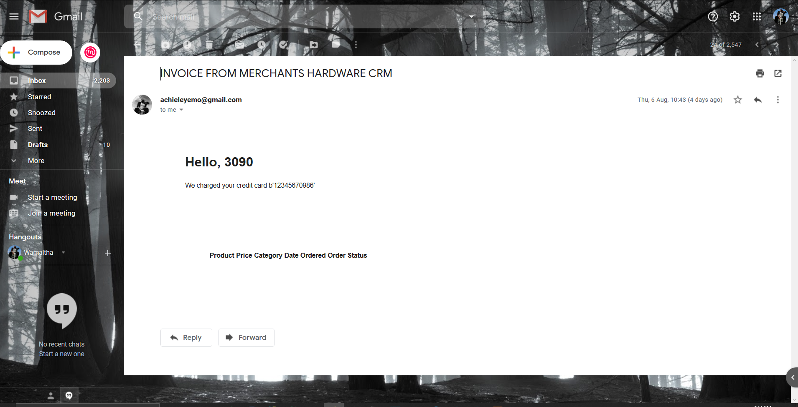

# Supervisor views

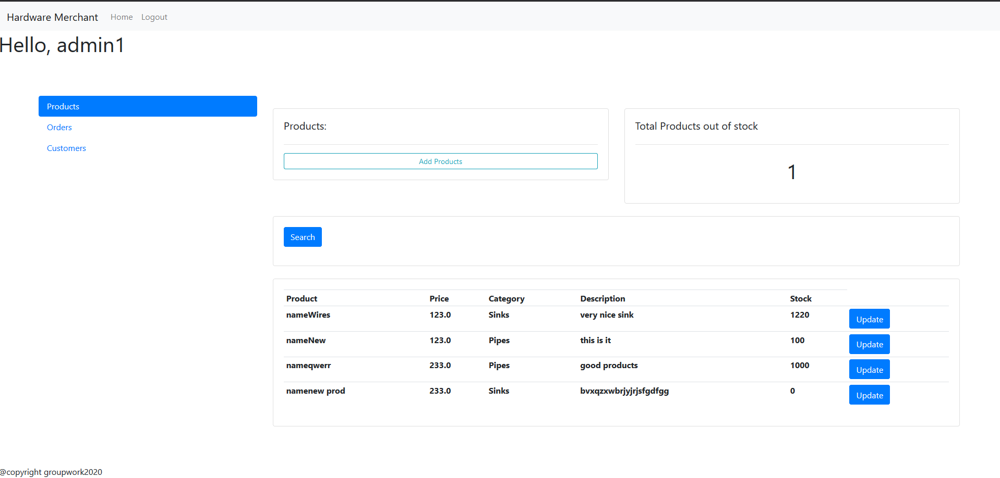
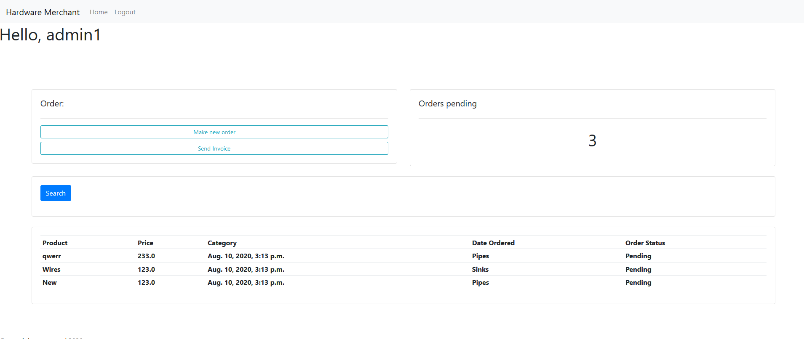

# Superuser view

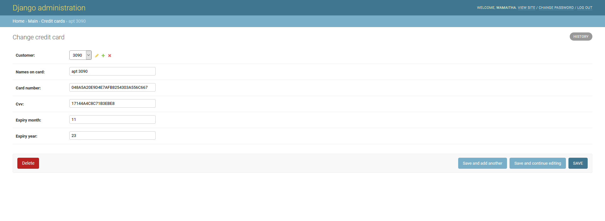

# Database Schema

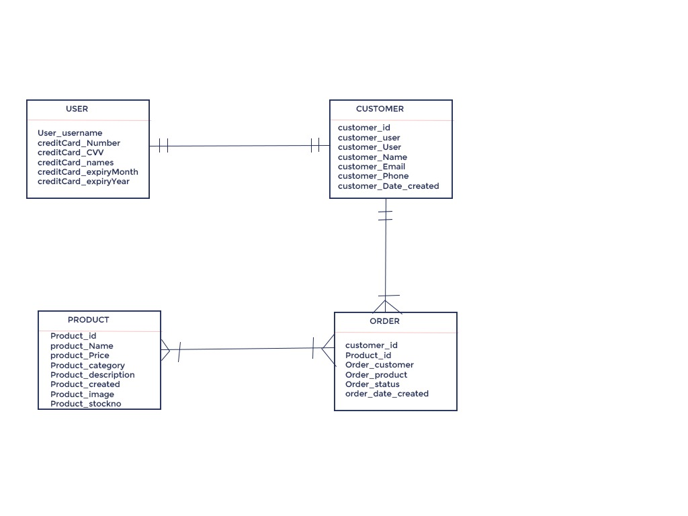

# Normalised database to 3NF

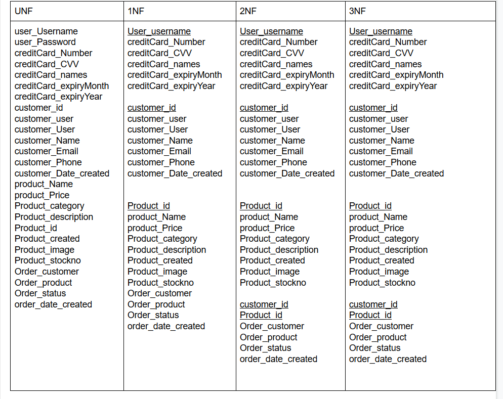